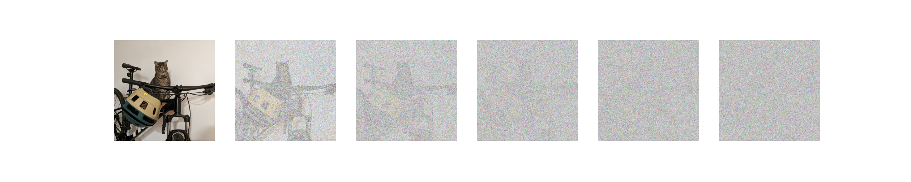
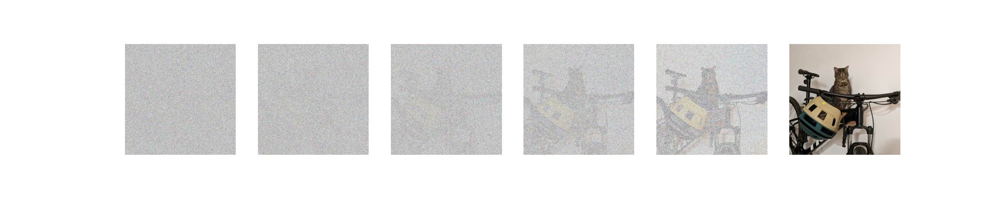
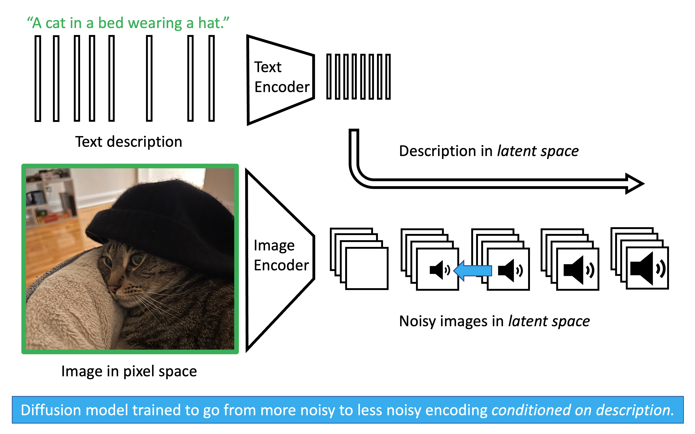
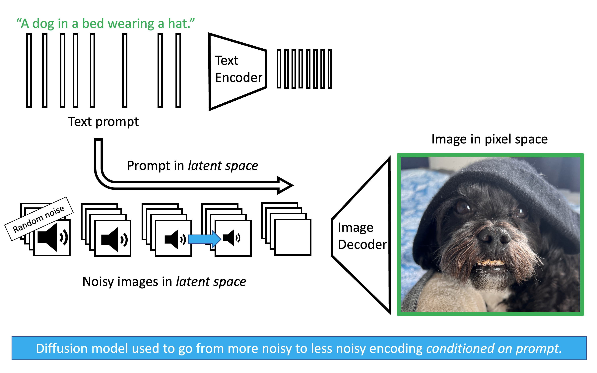

### Motivation

We previously discussed Variational Autoencoders (VAEs). VAEs are elegant models that allow us to sample realistic images by mapping a simple latent distribution (like a standard normal distribution) to the complex data distribution of our images. However, VAEs have a fundamental limitation: they generate the image in a single, fixed forward pass. In a VAE, you pass a latent vector through the decoder, and out pops the image. If the image is slightly blurry or imperfect, there is no way to tell the model to "think longer" or refine the output. The computation expended at inference time is constant. 

This is at odds with the most important lesson of modern deep learning: **scaling inference-time compute improves performance.** We see this prominently in Large Language Models (LLMs) with techniques like Chain-of-Thought reasoning. When an LLM is allowed to generate intermediate reasoning steps before answering, it effectively spends more compute to arrive at a much better final answer. 

How do we bring this "thinking longer" paradigm to image generation? Instead of trying to cross the massive chasm from pure noise to a photorealistic image in one single leap, we can break the journey down into hundreds of tiny, manageable steps. This is the core intuition behind **diffusion**. By repeatedly applying a de-noising process to a state of pure randomness, we trade inference time for generation quality. If we want a better image, we can simply increase the number of de-noising steps, allowing the model to more carefully trace the complex topology of the data distribution. Let's dive into the details.

### Adding Noise

Our ultimate goal is to turn random noise into a realistic image. But to teach a model how to do that, we first need to define the reverse: turning a realistic image into noise. 

Starting from a real image $x_0$, we slowly corrupt it by adding Gaussian noise over a series of $T$ steps. At each step $t$, we determine how much noise to add using our variance schedule, $\beta_t$. 

The mathematical transition from one step to the next is a Markov chain. Using the reparameterization trick we learned with VAEs, we can write a single step forward as:
$$x_t = \sqrt{1-\beta_t} x_{t-1} + \sqrt{\beta_t}\epsilon_t$$

If we step through this process sequentially $T$ times (where $T$ is usually large, like 1000), the final state $x_T$ becomes indistinguishable from pure, random noise. 

#### Skipping Steps (Direct Jump Property)

Iterating step-by-step during training would be incredibly slow. Fortunately, we can use a mathematical shortcut to jump directly from the clean image $x_0$ to any arbitrary noisy step $x_t$. 

Let's swap out our noise rate $\beta_t$ for our **signal retention rate**, $\alpha_t = 1 - \beta_t$. Rewriting our single step yields:
$$x_t = \sqrt{\alpha_t} x_{t-1} + \sqrt{1-\alpha_t}\epsilon_{t}$$

What happens if we substitute the equation for $x_{t-1}$ into the equation for $x_t$? Let $\epsilon_1, \epsilon_2$ be independent standard normal noise variables.
$$x_t = \sqrt{\alpha_t} (\sqrt{\alpha_{t-1}} x_{t-2} + \sqrt{1-\alpha_{t-1}}\epsilon_2) + \sqrt{1-\alpha_t}\epsilon_1$$
$$x_t = \sqrt{\alpha_t \alpha_{t-1}} x_{t-2} + \left( \sqrt{\alpha_t(1-\alpha_{t-1})}\epsilon_2 + \sqrt{1-\alpha_t}\epsilon_1 \right)$$

A beautiful property of Gaussians is that the sum of two independent normally distributed variables, $\mathcal{N}(0, \sigma_1^2)$ and $\mathcal{N}(0, \sigma_2^2)$, is a new Gaussian $\mathcal{N}(0, \sigma_1^2 + \sigma_2^2)$. Let's calculate the variance of the combined noise term:
$$\sigma_{\text{combined}}^2 = \alpha_t(1-\alpha_{t-1}) + (1-\alpha_t) = \alpha_t - \alpha_t\alpha_{t-1} + 1 - \alpha_t = 1 - \alpha_t\alpha_{t-1}$$

Because the variance gracefully collapses, our two-step jump simplifies to:
$$x_t = \sqrt{\alpha_t \alpha_{t-1}} x_{t-2} + \sqrt{1 - \alpha_t\alpha_{t-1}}\epsilon$$

By induction, if we apply this recursively all the way back to $x_0$, we can replace the chain of individual $\alpha$ terms with $\bar{\alpha}_t$ (the **cumulative** signal retention). The formula to directly sample a noisy image at any timestep $t$ becomes:
$$x_t = \sqrt{\bar{\alpha}_t}x_0 + \sqrt{1-\bar{\alpha}_t}\epsilon$$

This equation perfectly encapsulates the forward process: any noisy image $x_t$ is just a weighted blend of the clean image ($x_0$) and pure noise ($\epsilon$).

### Removing Noise

If we look at the forward process backwards, we have the exact training data needed to teach a model how to *remove* noise. 

In probability, we denote the true mathematical reverse step as $q(x_{t-1} | x_t)$. However, calculating this is impossible without knowing the distribution of all possible images in the universe. 

Here is the brilliant mathematical trick of diffusion: if we condition the reverse step on the *original* clean image $x_0$, the step becomes a highly tractable, solvable Gaussian distribution: $q(x_{t-1} | x_t, x_0)$. 

**Claim 1:** The true posterior conditioned on $x_0$ is a Gaussian distribution defined as:
$$q(x_{t-1} | x_t, x_0) = \mathcal{N}(x_{t-1}; \tilde{\mu}_t(x_t, x_0), \tilde{\beta}_t \mathbf{I})$$
*(Note: We use the tilde ($\sim$) to denote that these are the mathematically ideal, target values.)*

The exact variance and mean required to step backwards are:
$$\tilde{\beta}_t = \frac{1-\bar{\alpha}_{t-1}}{1-\bar{\alpha}_t} \beta_t$$
$$\tilde{\mu}_t(x_t, x_0) = \frac{\sqrt{\alpha_t}(1-\bar{\alpha}_{t-1})}{1-\bar{\alpha}_t}x_t + \frac{\sqrt{\bar{\alpha}_{t-1}}\beta_t}{1-\bar{\alpha}_t}x_0$$

::: {.proof-block}

Proof: Derivation of the Tractable Posterior

By Bayes' Rule, the reverse step is proportional to the forward steps:
$$q(x_{t-1} | x_t, x_0) \propto q(x_t | x_{t-1}, x_0) q(x_{t-1} | x_0)$$
*(We drop the denominator $q(x_t | x_0)$ as it acts merely as a normalizing constant that does not depend on $x_{t-1}$.)*

We know these distributions are Gaussians from our forward process equations:

1. $q(x_t | x_{t-1}, x_0) \propto \exp\left(-\frac{1}{2\beta_t} (x_t - \sqrt{\alpha_t}x_{t-1})^2\right)$

2. $q(x_{t-1} | x_0) \propto \exp\left(-\frac{1}{2(1-\bar{\alpha}_{t-1})} (x_{t-1} - \sqrt{\bar{\alpha}_{t-1}}x_0)^2\right)$

Multiplying these distributions means adding their exponents. Our goal is to rearrange this combined exponent into the standard Gaussian form: $-\frac{1}{2} \left[ \frac{1}{\tilde{\beta}_t} x_{t-1}^2 - \frac{2\tilde{\mu}_t}{\tilde{\beta}_t} x_{t-1} + C \right]$.

**Finding the Variance ($\tilde{\beta}_t$):**
By extracting only the $x_{t-1}^2$ terms from the added exponents, we get the inverse variance:
$$\frac{1}{\tilde{\beta}_t} = \frac{\alpha_t}{\beta_t} + \frac{1}{1-\bar{\alpha}_{t-1}}$$
Using a common denominator and the identity $\bar{\alpha}_t = \alpha_t \bar{\alpha}_{t-1}$, this simplifies to our exact reverse variance:
$$\tilde{\beta}_t = \frac{1-\bar{\alpha}_{t-1}}{1-\bar{\alpha}_t} \beta_t$$

**Finding the Mean ($\tilde{\mu}_t$):**
Next, extracting the linear $x_{t-1}$ terms gives us the coefficient for the mean:
$$\frac{\tilde{\mu}_t}{\tilde{\beta}_t} = \frac{\sqrt{\alpha_t}}{\beta_t}x_t + \frac{\sqrt{\bar{\alpha}_{t-1}}}{1-\bar{\alpha}_{t-1}}x_0$$
Multiplying both sides by our newly found variance $\tilde{\beta}_t$ and canceling the denominators cleanly yields our exact reverse mean:
$$\tilde{\mu}_t(x_t, x_0) = \frac{\sqrt{\alpha_t}(1-\bar{\alpha}_{t-1})}{1-\bar{\alpha}_t}x_t + \frac{\sqrt{\bar{\alpha}_{t-1}}\beta_t}{1-\bar{\alpha}_t}x_0$$

:::

This tells us exactly how to step backwards! But there's a catch: this tractable posterior requires $x_0$, and during generation, we start with pure noise. We don't *have* the clean image $x_0$. 

To solve this, we train a neural network (with weights denoted as $\theta$) to approximate this backward step. Because the amount of noise and the structure of the image change drastically from step $t=1000$ to $t=1$, the network must be explicitly conditioned on *both* the current noisy image $x_t$ and the current timestep $t$. 

We denote the neural network's approximated distribution as $p_\theta(x_{t-1} | x_t) = \mathcal{N}(x_{t-1}; \mu_\theta(x_t, t), \tilde{\beta}_t \mathbf{I})$, where $\mu_\theta(x_t, t)$ is the network's prediction for the mean.

### Loss Function

To train this network, we need an objective. We want our network's predicted reverse step $p_\theta(x_{t-1} | x_t)$ to match the true, mathematically ideal reverse step $q(x_{t-1} | x_t, x_0)$ as closely as possible.

We measure the difference between two probability distributions using the **Kullback-Leibler (KL) divergence**. 

**Claim 2:** Because both the true reverse step ($q$) and the network's predicted step ($p_\theta$) are Gaussians with identical, fixed variances ($\tilde{\beta}_t\mathbf{I}$), minimizing the KL divergence between them reduces perfectly to minimizing the Mean Squared Error (MSE) between their means ($\tilde{\mu}_t(x_t, x_0)$ and $\mu_\theta(x_t, t)$):
$$D_{KL}(q \| p_\theta) = \frac{1}{2\tilde{\beta}_t} \| \tilde{\mu}_t(x_t, x_0) - \mu_\theta(x_t, t) \|^2$$

::: {.proof-block}

Proof: KL Divergence reduces to Mean Squared Error

We want to find the KL divergence between our two Gaussian distributions:

1. The true posterior: $q(x) = \mathcal{N}(x; \tilde{\mu}_t(x_t, x_0), \tilde{\beta}_t \mathbf{I})$

2. The network's prediction: $p_\theta(x) = \mathcal{N}(x; \mu_\theta(x_t, t), \tilde{\beta}_t \mathbf{I})$
*(Note: We use $x$ here as shorthand for $x_{t-1}$)*

The formula for KL divergence is the expected log difference between the distributions:
$$D_{KL}(q \| p_\theta) = \mathbb{E}_{q} \left[ \log q(x) - \log p_\theta(x) \right]$$

A Gaussian PDF includes a normalizing constant $C$ that depends entirely on the variance. Since both distributions share the same variance $\tilde{\beta}_t$, this constant $C$ is identical for both:
$$\log q(x) = -\frac{1}{2\tilde{\beta}_t} \| x - \tilde{\mu}_t(x_t, x_0) \|^2 + C$$
$$\log p_\theta(x) = -\frac{1}{2\tilde{\beta}_t} \| x - \mu_\theta(x_t, t) \|^2 + C$$

Subtracting the two logs cancels out $C$:
$$\log q(x) - \log p_\theta(x) = \frac{1}{2\tilde{\beta}_t} \left( \| x - \mu_\theta(x_t, t) \|^2 - \| x - \tilde{\mu}_t(x_t, x_0) \|^2 \right)$$

To simplify this, we can expand $\| x - \mu_\theta(x_t, t) \|^2$ by adding and subtracting the true mean $\tilde{\mu}_t(x_t, x_0)$:
$$\| x - \mu_\theta(x_t, t) \|^2 = \| (x - \tilde{\mu}_t(x_t, x_0)) + (\tilde{\mu}_t(x_t, x_0) - \mu_\theta(x_t, t)) \|^2$$
Expanding this polynomial gives us three terms:
$$= \| x - \tilde{\mu}_t(x_t, x_0) \|^2 + 2(x - \tilde{\mu}_t(x_t, x_0))^T(\tilde{\mu}_t(x_t, x_0) - \mu_\theta(x_t, t)) + \| \tilde{\mu}_t(x_t, x_0) - \mu_\theta(x_t, t) \|^2$$

Substituting this expanded polynomial back into our log difference equation, the $\| x - \tilde{\mu}_t(x_t, x_0) \|^2$ terms instantly cancel each other out:
$$\log q(x) - \log p_\theta(x) = \frac{1}{2\tilde{\beta}_t} \left( 2(x - \tilde{\mu}_t(x_t, x_0))^T(\tilde{\mu}_t(x_t, x_0) - \mu_\theta(x_t, t)) + \| \tilde{\mu}_t(x_t, x_0) - \mu_\theta(x_t, t) \|^2 \right)$$

Finally, we take the expectation of this expression with respect to the true distribution $q(x)$. 
Because the expected value (the mean) of $x$ under distribution $q$ is exactly $\tilde{\mu}_t(x_t, x_0)$, the expectation of the term $(x - \tilde{\mu}_t(x_t, x_0))$ perfectly evaluates to $0$. The cross-term entirely vanishes! 

What remains is solely the difference between the means, independent of $x$:
$$D_{KL}(q \| p_\theta) = \frac{1}{2\tilde{\beta}_t} \| \tilde{\mu}_t(x_t, x_0) - \mu_\theta(x_t, t) \|^2$$

:::

To calculate the true target mean $\tilde{\mu}_t(x_t, x_0)$, the network mathematically has to estimate the completely clean, original image $x_0$. At early timesteps (when the image is only slightly blurry), this is doable. But at late timesteps (when the image is near-total static), asking the network to perfectly hallucinate the final, pristine image $x_0$ in a single leap is impossibly hard. The model's guesses swing wildly, leading to chaotic, high-variance gradients that aggressively destabilize training. 

Instead of asking the model what the final perfect picture looks like, we can reparameterize the objective. We reframe the question to: **"What specific pattern of static is currently obfuscating this image?"** Unlike the highly complex distribution of real images, the noise $\epsilon$ is always drawn from a simple standard normal distribution. Therefore, the target the network is trying to predict ($\epsilon$) is strictly bounded and statistically consistent across all timesteps. It is far easier and numerically stable for the network, which we will now denote as predicting noise via $\epsilon_\theta(x_t, t)$, to iteratively identify and scrape off bounded layers of static than to blindly guess a masterpiece from pure noise.

**Claim 3:** By reparameterizing the network to predict the noise $\epsilon_\theta(x_t, t)$ instead of directly predicting the mean $\mu_\theta(x_t, t)$, the squared distance between the true and predicted means is strictly proportional to the squared distance between the true noise $\epsilon$ and the predicted noise $\epsilon_\theta(x_t, t)$:
$$\|\tilde{\mu}_t(x_t, x_0) - \mu_\theta(x_t, t)\|^2 = \frac{\beta_t^2}{\alpha_t(1-\bar{\alpha}_t)} \|\epsilon - \epsilon_\theta(x_t, t)\|^2$$

::: {.proof-block}

Proof: Converting Mean Prediction to Noise Prediction

Currently, our loss relies on the difference in means: $\| \tilde{\mu}_t(x_t, x_0) - \mu_\theta(x_t, t) \|^2$. 
Let's look closely at the true mean $\tilde{\mu}_t(x_t, x_0)$. It requires the clean image $x_0$. However, from our forward process shortcut, we know that:
$$x_t = \sqrt{\bar{\alpha}_t}x_0 + \sqrt{1-\bar{\alpha}_t}\epsilon$$

We can rearrange this to solve for the clean image $x_0$:
$$x_0 = \frac{1}{\sqrt{\bar{\alpha}_t}}(x_t - \sqrt{1-\bar{\alpha}_t}\epsilon)$$

Now, substitute this $x_0$ definition into our previously derived equation for the true mean $\tilde{\mu}_t$:
$$\tilde{\mu}_t(x_t, x_0) = \frac{\sqrt{\alpha_t}(1-\bar{\alpha}_{t-1})}{1-\bar{\alpha}_t}x_t + \frac{\sqrt{\bar{\alpha}_{t-1}}\beta_t}{1-\bar{\alpha}_t} \left( \frac{1}{\sqrt{\bar{\alpha}_t}}(x_t - \sqrt{1-\bar{\alpha}_t}\epsilon) \right)$$

With some algebraic grouping (recognizing that $\bar{\alpha}_t = \alpha_t \bar{\alpha}_{t-1}$), this cleanly simplifies to showing that the true mean is just a function of the true noise $\epsilon$:
$$\tilde{\mu}_t(x_t, \epsilon) = \frac{1}{\sqrt{\alpha_t}} \left( x_t - \frac{\beta_t}{\sqrt{1-\bar{\alpha}_t}}\epsilon \right)$$

Since $x_t$ and $t$ are known inputs during training, we can configure our neural network to output exactly the same structure, predicting the noise term $\epsilon_\theta(x_t, t)$ instead of the whole mean:
$$\mu_\theta(x_t, t) = \frac{1}{\sqrt{\alpha_t}} \left( x_t - \frac{\beta_t}{\sqrt{1-\bar{\alpha}_t}}\epsilon_\theta(x_t, t) \right)$$

Now, let's subtract the network's prediction from the true target mean. The $x_t$ terms cancel out, leaving:
$$\tilde{\mu}_t(x_t, x_0) - \mu_\theta(x_t, t) = -\frac{\beta_t}{\sqrt{\alpha_t(1-\bar{\alpha}_t)}} (\epsilon - \epsilon_\theta(x_t, t))$$

Finally, we plug this back into our simplified KL Divergence loss from Claim 2, remembering to square it:
$$D_{KL} = \frac{1}{2\tilde{\beta}_t} \left\| -\frac{\beta_t}{\sqrt{\alpha_t(1-\bar{\alpha}_t)}} (\epsilon - \epsilon_\theta(x_t, t)) \right\|^2$$
$$D_{KL} = \frac{\beta_t^2}{2\tilde{\beta}_t \alpha_t (1-\bar{\alpha}_t)} \| \epsilon - \epsilon_\theta(x_t, t) \|^2$$

:::

Empirically, researchers found that the complicated coefficient $\frac{\beta_t^2}{2\tilde{\beta}_t \alpha_t (1-\bar{\alpha}_t)}$ focuses too much of the model's capacity on extremely noisy timesteps that are hard to learn. Dropping this complex weight entirely makes training much more stable and produces higher-quality images. This leaves us with an elegantly simple Mean Squared Error (MSE) objective:
$$\mathcal{L}_\text{simple}(\theta) = \mathbb{E}_{t, x_0, \epsilon} \left[ \| \epsilon - \epsilon_\theta(x_t, t) \|^2 \right]$$
*(In plain English: "Minimize the squared difference between the true noise $\epsilon$ and the noise our network $\theta$ predicted, given $x_t$ at timestep $t$").*

### Inference

Now that we have a trained neural network $\epsilon_\theta$ that can estimate the noise added to an image at any timestep $t$, how do we actually generate a new image from scratch? We perform the reverse Markov chain iteratively. 

Instead of treating this backward step as a black-box calculation, it is highly intuitive to think of the model performing two distinct actions at every timestep:

**Hallucinate the final image:** Look at the current noisy state $x_t$ and make a best guess for what the perfectly clean, final image looks like. We denote this guess as $\hat{x}_0$.

**Take a mathematical half-step:** Use the exact formulas from our true forward process to add noise *back* onto that perfect hallucination until it reaches the slightly noisy state $x_{t-1}$.

The sampling algorithm proceeds as follows:

1. **Start with pure noise:** Sample an initial state $x_T$ from a standard normal distribution:
   $$x_T \sim \mathcal{N}(\mathbf{0}, \mathbf{I})$$

2. **Iteratively denoise:** Loop backwards through time for $t = T, T-1, \dots, 1$. At each step:
   
   **a. Predict the clean image ($\hat{x}_0$):**
   Using our network's prediction of the noise $\epsilon_\theta(x_t, t)$, we algebraically back out what the clean image must be based on our forward process equation ($x_t = \sqrt{\bar{\alpha}_t}x_0 + \sqrt{1-\bar{\alpha}_t}\epsilon$):
   $$\hat{x}_0 = \frac{1}{\sqrt{\bar{\alpha}_t}}(x_t - \sqrt{1-\bar{\alpha}_t}\epsilon_\theta(x_t, t))$$

   **b. Compute the sampling mean:**
   Now that we have a guess for the clean image, we plug $\hat{x}_0$ directly into the exact mean of our true tractable posterior from Claim 1 ($\tilde{\mu}_t(x_t, x_0)$):
   $$\mu_\theta(x_t, t) = \frac{\sqrt{\alpha_t}(1-\bar{\alpha}_{t-1})}{1-\bar{\alpha}_t}x_t + \frac{\sqrt{\bar{\alpha}_{t-1}}\beta_t}{1-\bar{\alpha}_t}\hat{x}_0$$
   *(Note: If you substitute the equation for $\hat{x}_0$ into this mean equation, the algebra elegantly collapses into a single step: $\frac{1}{\sqrt{\alpha_t}} \left( x_t - \frac{1 - \alpha_t}{\sqrt{1-\bar{\alpha}_t}}\epsilon_\theta(x_t, t) \right)$).*

   **c. Sample with variance:**
   Finally, we draw our sample $x_{t-1}$ from the distribution $\mathcal{N}(\mu_\theta(x_t, t), \sigma_t^2 \mathbf{I})$ using the reparameterization trick:
   $$x_{t-1} = \mu_\theta(x_t, t) + \sigma_t z$$

   Where:
   * $z \sim \mathcal{N}(\mathbf{0}, \mathbf{I})$ if $t > 1$. We inject this noise to prevent the model from collapsing to a blurry, averaged state during the intermediate steps.
   * $z = \mathbf{0}$ if $t = 1$. At the final step, we want the crisp, final image without any added noise.
   * The variance $\sigma_t^2$ is typically chosen as either $\tilde{\beta}_t$ or $\beta_t$.

3. **Return final image:** Once the loop reaches $t=0$, the resulting $x_0$ is our generated image.

### Conditioning and Guidance

Once we have a trained diffusion model, it can generate highly realistic images from pure noise. But what if we want to generate a *specific* image, like "A dog in a bed wearing a hat"? We can **condition** the diffusion process on text (denoted as condition $c$). 

I like to think of this text conditioning in the context of watching clouds with a friend. If a cloud is just random noise, it looks like nothing. But the moment a friend says, "Doesn't that look like a turtle?", your brain immediately latches onto the shapes and starts to see a turtle. In the same way, if we tell a diffusion model that a matrix of random noise is a turtle, the model uses that text condition $c$ as a map for which noise to remove to reveal the turtle.

As shown in the **training image** above, we provide the model with an image and a corresponding text description. Both are passed through pretrained encoders (like VAEs or CLIP) to map them into a compressed latent space. We apply noise to the image's latent representation. Crucially, when we ask the diffusion model to predict the noise $\epsilon$, we also pass it the encoded text. Through mechanisms like cross-attention, the model learns the statistical relationship between specific words and specific visual features it needs to de-noise.

The **testing image** illustrates how this works during inference. We start with pure random noise and our encoded text prompt. The diffusion model iteratively predicts and removes the noise, at every step querying the text embedding to ensure the geometry it is carving out matches the prompt. Once the latent noise has been fully sculpted into a latent image, a pretrained decoder translates it back into pixel space.

To make the model follow the prompt strictly, modern architectures use **Classifier-Free Guidance (CFG)**. We ask the model to make two predictions simultaneously during the inference loop: 

1. A prediction *with* the text prompt: $\epsilon_\theta(x_t, t, c)$

2. A prediction *without* any text prompt (an unconditional guess): $\epsilon_\theta(x_t, t, \emptyset)$

We then calculate the final noise prediction ($\tilde{\epsilon}_\theta$) by moving *away* from the unconditional guess and strictly *toward* the conditioned guess. The strength of this effect is governed by a guidance scale $w$:
$$\tilde{\epsilon}_\theta = (1+w)\epsilon_\theta(x_t, t, c) - w \epsilon_\theta(x_t, t, \emptyset)$$

By amplifying the difference between the conditioned and unconditioned states, we force the model to vividly hallucinate exactly what we asked for.