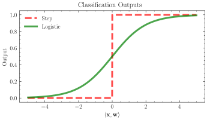
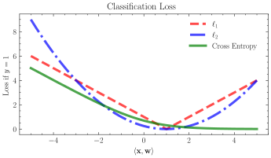
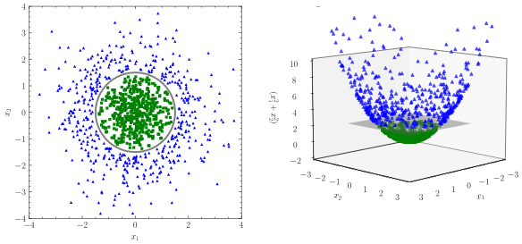
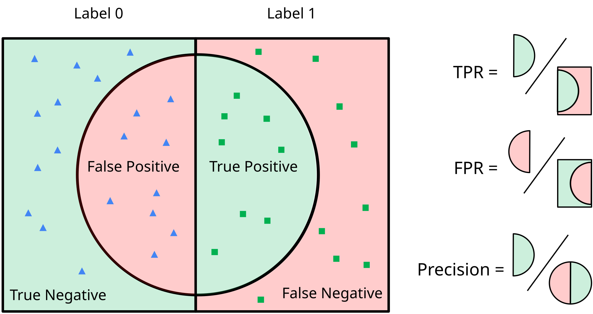
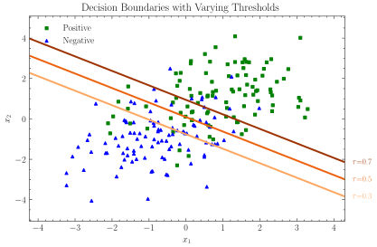
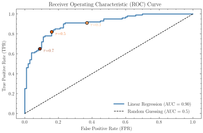

So far, we have seen how to use linear regression to predict a continuous value from a set of features.
However, in many settings, we are interested in predicting a discrete value, such as a class label.
Today, we will see how we can generalize linear regression to the classification setting by introducing a non-linearity to the model, which gives us *logistic regression*.

Our setup will be the standard supervised learning setting, where we have labeled data $(\mathbf{x}^{(1)}, y^{(1)}), \ldots, (\mathbf{x}^{(n)}, y^{(n)})$, for $\mathbf{x}^{(i)} \in \mathbb{R}^d$ the feature vector for the $i$th example. 
However, unlike regression where we output a continuous value $y^{(i)} \in \mathbb{R}$, we will now predict a binary value $y^{(i)} \in \{0, 1\}$.
We can use the same linear model as before, i.e., we will predict the output as $\langle \mathbf{w}, \mathbf{x}^{(i)} \rangle$, where $\mathbf{w} \in \mathbb{R}^d$ is the weight vector.
But, we run into an issue: the output of the linear model can take on any real value, but we want to predict a binary value.

### Model

We'll explore several attempts to convert our linear model into a binary classifier.

Attempt #1: We could simply apply a step function to the output of the linear model, i.e., predict $y^{(i)} = 1$ if $\langle \mathbf{w}, \mathbf{x}^{(i)} \rangle > 0$ and $y^{(i)} = 0$ otherwise. The loss could be the difference between the predicted value and the true value, i.e., $\mathcal{L}(\mathbf{w}) = \sum_{i=1}^n |y^{(i)} - \langle \mathbf{w}, \mathbf{x}^{(i)} \rangle|$. However, this loss is not differentiable, so we cannot use gradient descent to optimize it.

Attempt #2: We could use the mean squared error loss, i.e., $\mathcal{L}(\mathbf{w}) = \sum_{i=1}^n (y^{(i)} - \langle \mathbf{w}, \mathbf{x}^{(i)} \rangle)^2$. This loss is differentiable, but it does not work well for classification problems: if we have a large positive value for $\langle \mathbf{w}, \mathbf{x}^{(i)} \rangle$, the loss will be large even if $y^{(i)} = 1$.

Attempt #3: We can apply the *sigmoid function* to the output of the linear model to map it to the range $(0, 1)$, i.e., we will predict $f(\mathbf{x}^{(i)}) = \sigma(\langle \mathbf{w}, \mathbf{x}^{(i)} \rangle)$, where $\sigma(z) = \frac{1}{1 + e^{-z}}$ is the sigmoid function. The sigmoid function is a smooth, non-linear function that maps any real number to the range $(0, 1)$. We can then interpret $f(\mathbf{x}^{(i)})$ as the probability that $y^{(i)} = 1$ given the features $\mathbf{x}^{(i)}$. If we need to report a class label, we can threshold the predicted probability, e.g., predict $y^{(i)} = 1$ if $f(\mathbf{x}^{(i)}) > \frac12$ and $y^{(i)} = 0$ otherwise.

### Cross-Entropy Loss

To train our model, we need a loss function that measures how well our predicted probabilities match the true labels. A common choice is the *binary cross-entropy loss*, which is defined as
$$\mathcal{L}(\mathbf{w}) = - \sum_{i=1}^n \left[y^{(i)} \log(f(\mathbf{x}^{(i)})) + (1 - y^{(i)}) \log(1 - f(\mathbf{x}^{(i)}))\right].$$

While MSE measures the geometric distance between two points, Cross-Entropy measures the difference between two probability distributions. Since our logistic model predicts probabilities, cross-entropy is the more natural choice. To understand why, we can look at it from two perspectives: the intuition behind the loss function, and the mathematical justification for it.

#### The Intuition: Penalizing "Confident" Mistakes

Intuitively, we want a loss function that punishes the model heavily when it makes a wrong prediction with high confidence.

Let's look at the component of the loss for a single example where the true label is positive ($y=1$). The loss simplifies to: $- \log(f(\mathbf{x}))$.

* Scenario A (Good Prediction): If the model predicts $f(\mathbf{x}) = 0.99$, it is confident and correct. The loss is $- \log(0.99) \approx 0.01$. The penalty is tiny.

* Scenario B (Bad Prediction): If the model predicts $f(\mathbf{x}) = 0.01$, it is confident but wrong. The loss is $- \log(0.01) \approx 4.6$. The penalty is huge.

Unlike MSE, which is bounded (the squared error between 0 and 1 can never exceed 1), Cross-Entropy can grow arbitrarily large. This effectively screams at the model to fix parameters that result in confidently wrong predictions.

#### The Math: Maximum Likelihood Estimation (MLE)

The formal justification comes from statistics. In the probabilistic view, we assume the data is generated independently from a Bernoulli distribution.
For a single data point $(\mathbf{x}^{(i)}, y^{(i)})$, the probability of observing the correct label $y^{(i)}$ given our prediction $f(\mathbf{x}^{(i)})$ is:
$$
P(y^{(i)} | \mathbf{x}^{(i)}; \mathbf{w}) = f(\mathbf{x}^{(i)})^{y^{(i)}} (1 - f(\mathbf{x}^{(i)}))^{1 - y^{(i)}}
$$

If $y^{(i)}=1$, this simplifies to $f(\mathbf{x}^{(i)})$. If $y^{(i)}=0$, this simplifies to $1 - f(\mathbf{x}^{(i)})$. We want to find the weights $\mathbf{w}$ that maximize the probability of the entire dataset. This is the likelihood function:
$$
L(\mathbf{w}) = \prod_{i=1}^n P(y^{(i)} | \mathbf{x}^{(i)}; \mathbf{w})
$$
Maximizing a product of many small probabilities is numerically unstable (floating point underflow). However, maximizing the likelihood is equivalent to maximizing the log-likelihood (since $\log$ is monotonic).
$$
\log L(\mathbf{w}) = \sum_{i=1}^n \log P(y^{(i)} | \mathbf{x}^{(i)}; \mathbf{w})
$$
Expanding this term:
$$
\log L(\mathbf{w}) = \sum_{i=1}^n \left[ y^{(i)} \log(f(\mathbf{x}^{(i)})) + (1 - y^{(i)}) \log(1 - f(\mathbf{x}^{(i)})) \right]
$$
In optimization, we prefer to minimize loss rather than maximize likelihood. So, we take the negative of the log-likelihood.
$$
\mathcal{L}(\mathbf{w}) = -\log L(\mathbf{w})
$$

We have shown that Minimizing Binary Cross-Entropy is mathematically identical to finding the Maximum Likelihood Estimate for our data under a Bernoulli distribution. This provides a rigorous statistical footing for our choice of loss function.

### Optimization

Once we have a model and loss function, we have seen two ways to optimize the model:
*Exact optimization*, where we compute the gradient of the loss function with respect to the model parameters and set the gradient to zero to find the optimal parameters.
*Gradient descent*, where we iteratively update the model parameters in the direction of the negative gradient of the loss function.
Both approaches require the gradient of the loss function with respect to the model parameters, so let's compute the gradient of $\mathcal{L}(\mathbf{w})$ with respect to $\mathbf{w}$.

**Lemma:** $\nabla_{\mathbf{w}} \mathcal{L}(\mathbf{w}) =  \mathbf{X}^\top \left(\sigma(\mathbf{X} \mathbf{w}) - \mathbf{y}\right).$

::: {.proof-block}

Proof of Lemma

Let $z = \langle \mathbf{w}, \mathbf{x} \rangle$ and $\hat{y} = \sigma(z)$. We rely on two standard identities:

**Sigmoid Derivative:** $\sigma'(z) = \sigma(z)(1 - \sigma(z)) = \hat{y}(1-\hat{y})$.

**Partial of Loss w.r.t. Prediction:** For binary cross-entropy $\ell = -y \log \hat{y} - (1-y) \log (1-\hat{y})$, the derivative is:
$$
\frac{\partial \ell}{\partial \hat{y}} = -\frac{y}{\hat{y}} + \frac{1-y}{1-\hat{y}} = \frac{\hat{y} - y}{\hat{y}(1-\hat{y})}
$$

Using the chain rule, we compute the gradient with respect to $\mathbf{w}$ by passing through the logit $z^{(i)}$.
$$
\begin{align*}
\nabla_\mathbf{w} \mathcal{L}(\mathbf{w}) 
&= \sum_{i=1}^n \frac{\partial \ell^{(i)}}{\partial \hat{y}^{(i)}} \cdot \underbrace{\frac{\partial \hat{y}^{(i)}}{\partial z^{(i)}}}_{\text{Sigmoid deriv.}} \cdot \underbrace{\nabla_\mathbf{w} z^{(i)}}_{\mathbf{x}^{(i)}} \\
&= \sum_{i=1}^n \left( \frac{\hat{y}^{(i)} - y^{(i)}}{\hat{y}^{(i)}(1-\hat{y}^{(i)})} \right) \cdot \left( \hat{y}^{(i)}(1-\hat{y}^{(i)}) \right) \cdot \mathbf{x}^{(i)} \\
&= \sum_{i=1}^n (\hat{y}^{(i)} - y^{(i)}) \mathbf{x}^{(i)}
\end{align*}
$$
By stacking the vectors $\mathbf{x}^{(i)}$ into the matrix $\mathbf{X}$ and errors into the vector $(\sigma(\mathbf{X}\mathbf{w}) - \mathbf{y})$, this directly vectorizes to:
$$
\nabla_\mathbf{w} \mathcal{L}(\mathbf{w}) = \mathbf{X}^\top (\sigma(\mathbf{X}\mathbf{w}) - \mathbf{y}).
$$

:::

Our exact optimization approach would be to set the gradient to zero and solve for $\mathbf{w}$.
Do you see why this doesn't work with the non-linear sigmoid function?

Instead of exact optimization, we will use gradient descent!

### Non-linear Transformations

Often, our data is not linearly separable, i.e., we cannot draw a straight line to separate the two classes.
In this case, we can use non-linear transformations to map the data to a higher-dimensional space, where it *is* linearly separable.
One approach: As we saw for linear regression, we can add polynomial features to the data.
In the image below, we add a new feature $x_1^2 + x_2^2$ to the data, which allows us to separate the two classes with a linear decision boundary in the transformed feature space.

It is not *a priori* clear which non-linear transformation will work best for a given dataset.
One approach is to use [kernel methods](KernelMethods.html) to implicitly map the data to a higher-dimensional space, which captures many of the non-linear transformations we might want to use.

### Measuring Error in Binary Classification

The simplest way to measure the error of a classification model is to compute the *error rate*, which is the fraction of examples that are misclassified. For example, if we have $n$ examples and our model misclassifies $k$ of them, the error rate is $\frac{k}{n}$.

However, the error rate does not take into account *which* points are misclassified.
We will often break down the accuracy of a classification model into four categories:  
- **True Positives (TP):** The model correctly predicts a positive class.  
- **True Negatives (TN):** The model correctly predicts a negative class.  
- **False Positives (FP):** The model incorrectly predicts a positive class when the true class is negative.    
- **False Negatives (FN):** The model incorrectly predicts a negative class when the true class is positive.

The raw counts of these four categories can be summarized in a **confusion matrix**. The confusion matrix is a square matrix with dimensions equal to the number of classes, where the rows represent the true classes and the columns represent the predicted classes.

But, these raw counts themselves are not very informative.

We often report the **True Positive Rate (TPR)**, also known as *recall*, which is the fraction of true positives out of all actual positives:
$\text{TPR} = \frac{\text{TP}}{\text{TP} + \text{FN}}.$
The TPR measures how well the model identifies positive examples (higher is better).

We also report the **False Positive Rate (FPR)**, which is the fraction of false positives out of all actual negatives:
$\text{FPR} = \frac{\text{FP}}{\text{FP} + \text{TN}}.$
The FPR measures how often the model incorrectly identifies negative examples as positive (lower is better).

Finally, we can report the **Precision**, which is the fraction of true positives out of all predicted positives:
$\text{Precision} = \frac{\text{TP}}{\text{TP} + \text{FP}}.$
Precision measures how well the model identifies positive examples among all predicted positives (higher is better).

If we have a model that does not achieve the desired TPR or FPR, we have a hidden lever we can pull: the threshold for predicting a positive class.
By default, we predict a positive class if the predicted probability is greater than $\frac12$.
But, we can change this threshold to an arbitrary value $\tau \in [0, 1]$.
Increasing the threshold decreases the number of positive predictions, which decreases both TPR and FPR:
The TPR decreases because we are less likely to predict a positive class, so we will miss more true positives.
The FPR decreases because we are less likely to predict a positive class, so we will make fewer false positive predictions.

We can visualize the trade-off between TPR and FPR by plotting the **Receiver Operating Characteristic (ROC) curve**. The ROC curve is a plot of the TPR against the FPR for different threshold values $\tau$.
Because a higher TPR is better and a lower FPR is better, we want the ROC curve to be as close to the top-left corner as possible.
The area under the ROC curve (AUC) is a single number that summarizes the performance of the model across all threshold values.
A model with an AUC of 1 is perfect, while a model with an AUC of 0.5 is no better than random guessing.

### Multiple Classes

In many settings, we are interested in classifying data into more than two classes.
For example, we might want to classify images into different categories, such as cats, dogs, and birds.
In this case, we need to extend our binary classification model to handle multiple classes.
Our supervised learning setup remains the same, where we have labeled data $(\mathbf{x}^{(1)}, y^{(1)}), \ldots, (\mathbf{x}^{(n)}, y^{(n)})$, but now $y^{(i)} \in \{1, 2, \ldots, k\}$, for $k$ the number of classes.

We can still use the same ideas that we used for binary logistic regression, but we need to extend the output of the model to predict a probability distribution over the $k$ classes.
Instead of a single output, which we can interpret as the probability of the positive class, we will have a vector of outputs $\mathbf{f}(\mathbf{x}^{(i)}) \in \mathbb{R}^k$, where $k$ is the number of classes.

To ensure this vector is a valid probability distribution, we can use the *softmax function*, defined as
$$
\begin{align*}
\text{softmax}(\mathbf{z}) &= \begin{bmatrix}
\frac{e^{z_1}}{\sum_{j=1}^k e^{z_j}} \\
\frac{e^{z_2}}{\sum_{j=1}^k e^{z_j}} \\
\vdots \\
\frac{e^{z_k}}{\sum_{j=1}^k e^{z_j}} \\
\end{bmatrix}
\end{align*}
$$
Softmax applies the exponential function to each element of the vector, and then normalizes the resulting vector so that the sum of the elements in the resulting vector is 1.
This ensures that the output is a valid probability distribution, where each probability is between 0 and 1 and the sum of all elements is 1.

The loss function for multi-class classification is the *cross-entropy loss*, which is a generalization of the binary cross-entropy loss:
$$
\begin{align*}
\mathcal{L}(\mathbf{w}) &= - \sum_{i=1}^n \sum_{j=1}^k \mathbb{1}[y^{(i)}=j] \log\left(f_j(\mathbf{x}^{(i)})\right),
\end{align*}
$$
where $f_j(\mathbf{x}^{(i)})$ is the $j$th element of the softmax output vector $\mathbf{f}(\mathbf{x}^{(i)})$,
and $\mathbb{1}[y^{(i)}=j]$ is an indicator function that is 1 if $y^{(i)} = j$ and 0 otherwise.
