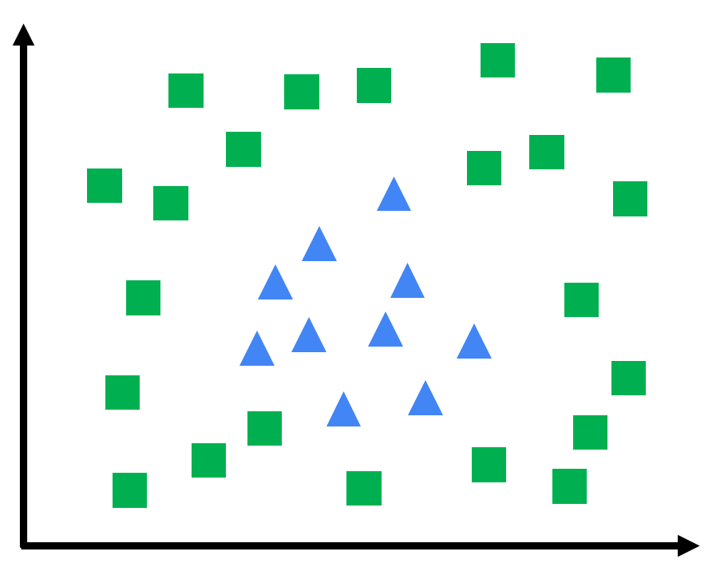
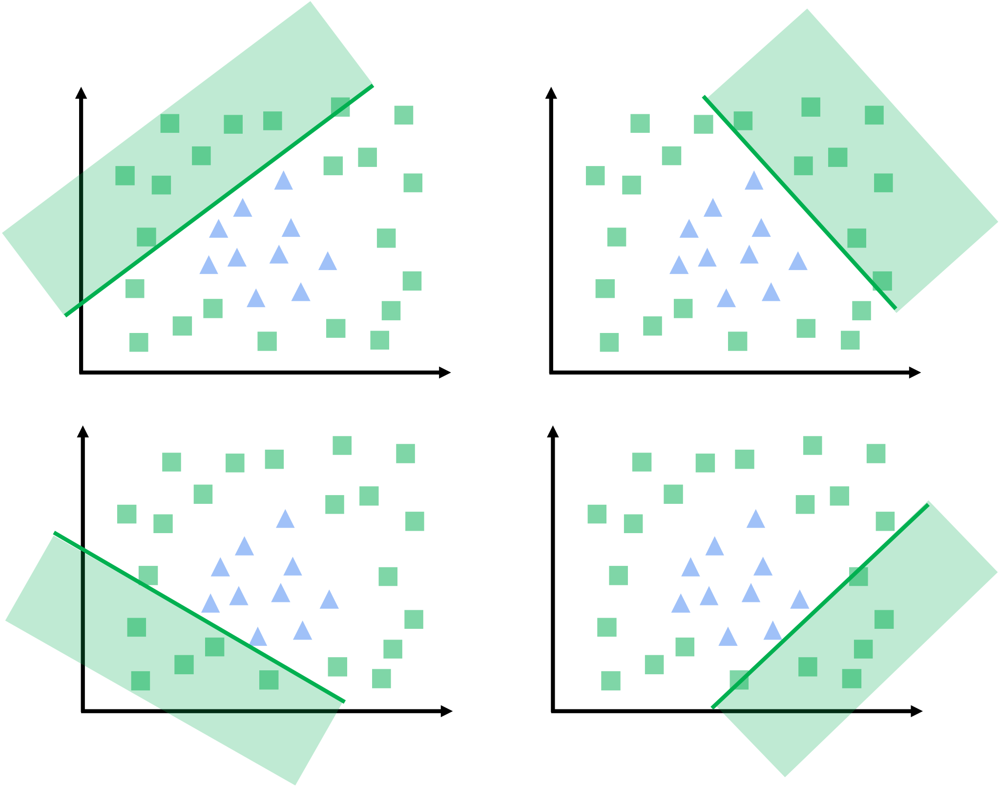
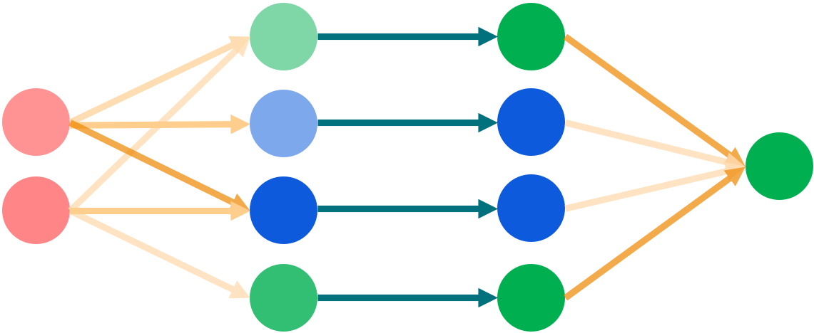
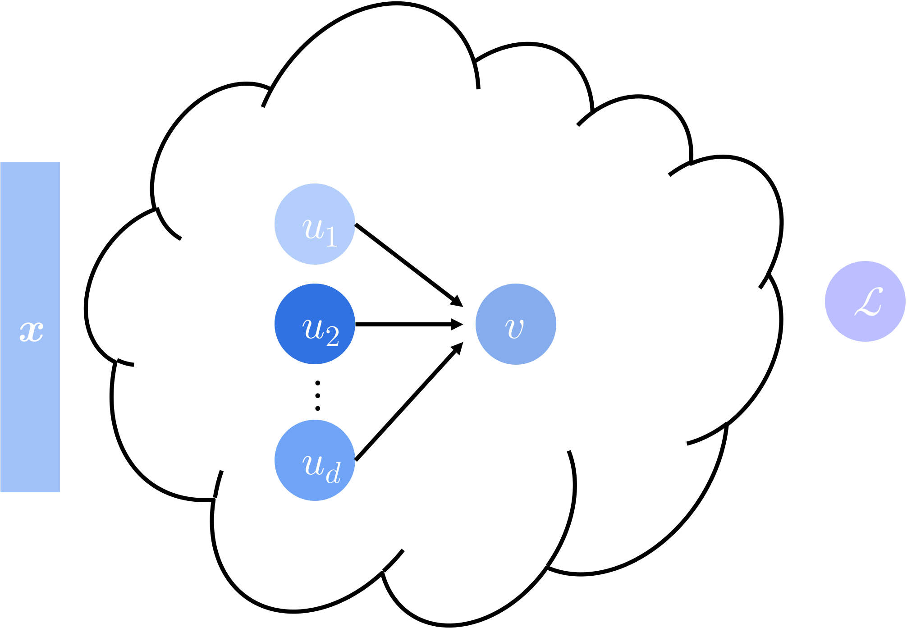
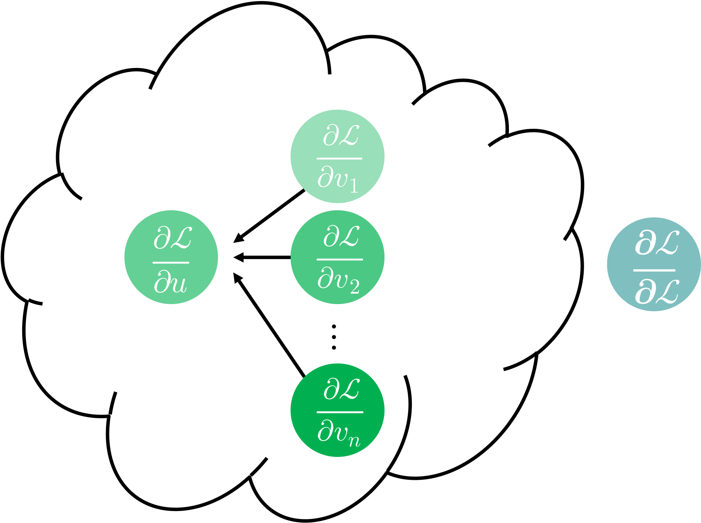

Previously, we have built machine learned models in two steps:
First, we chose a set of features to represent the data, possibly transforming the data in the process.
Second, we optimized a model on the (transformed) features.
Neural networks allow us to learn both the feature transformations and the model *simultaneously*.

### Neural Network Architectures

Consider training data that is not linearly separable, i.e., we cannot draw a straight line to separate the classes.
We saw before how we could represent the data in a higher-dimensional space, where it is linearly separable.
The alternative we'll explore today is to divide the region with multiple linear boundaries.

We can learn four linear boundaries, each of which bounds the region in a different direction.

When we pass the input through the learned lines, we will get real numbers proportional to the distance from the line e.g., $\langle \mathbf{x}, \mathbf{w}^{(i)} \rangle$.
Let's apply a non-linear activation function to these distances, which will distinguish whether the distance is positive or negative e.g., $\sigma(\langle \mathbf{x}, \mathbf{w}^{(i)} \rangle)$, where $\sigma(z) = \mathbf{1}[z \geq 0]$.
(In practice, the step function is rarely used because its gradient is zero almost everywhere, which makes it difficult to train the model with gradient descent. Instead, we typically use the ReLU function $\sigma(z) = \max(0, z)$, which has a non-zero gradient for positive inputs.)
For example, a point on the "green" side of the first line, "blue" side of the second line, "blue" side of the third line, and "green" side of the fourth line would be represented as $[1, 0, 0, 1]$.
Finally, we can combine these values to make a prediction.

In this way, we can learn a non-linear function by combining multiple linear models with non-linear activations.
By updating the weights of the linear models and the weights of the final combination, we can learn a complex function that fits the data well.

Neural networks are remarkably flexible, with many different architectural options: 

- The **activation functions** which process the outputs of the linear models. Options include the ReLU function $\sigma(z) = \max(0, z)$, the sigmoid function $\sigma(z) = \frac{1}{1 + e^{-z}}$, the hyperbolic tangent function $\sigma(z) = \tanh(z)$, and more. 

- The **number of layers** in the network, i.e., how many times we apply the linear models and activation functions. 

- The **number of neurons** in each layer, i.e., the dimension of the output of every layer. 

- The **loss function** to measure the error between the predicted and true labels. We can use the same loss functions we have seen before: cross-entropy for classification and squared error for regression. 

Tensorflow offers an excellent visualization of common neural network architectures, which you can play around with [here](https://playground.tensorflow.org/).

Beyond these options, there are several types of neural network architectures that connect neurons in different ways:
Convolutional layers are particularly useful for locally correlated data, such as images, where we can learn filters that capture local patterns.
Transformers are particularly useful for sequential data, such as text, and form the backbone of modern foundation models.
We will explore these architectures next week!

When we train a neural network, we apply gradient descent to minimize the loss function, just like we have done for linear regression and logistic regression.
But we need to be careful about how we compute the gradients, since the neural network is a composition of multiple functions, and there can be *many* parameters.

### Backpropagation

The key step in training a neural network is to compute the gradients of the loss function with respect to each of the parameters in the network.
*Backpropagation* allows us to compute these gradients efficiently.
The basic idea is to modularly apply the chain rule from calculus to compute the gradients of each layer, starting from the output layer and working backwards to the input layer.

Before we dive into the details, let's review the chain rule.
For a scalar function $f: \mathbb{R} \to \mathbb{R}$, we write the derivative as
$$
\frac{\partial f}{\partial x} = \lim_{t \to 0} \frac{f(x + t) - f(x)}{t}.
$$

For a multivariate function $f: \mathbb{R}^m \to \mathbb{R}$, we write the partial derivative as
$$
\frac{\partial f}{\partial x_i} = \lim_{t \to 0} \frac{f(x_1, \ldots, x_i + t, \ldots, x_m) - f(x_1, \ldots, x_i, \ldots, x_m)}{t}.
$$

Consider two functions $f: \mathbb{R} \to \mathbb{R}$ and $g: \mathbb{R} \to \mathbb{R}$.
The chain rule tells us that the derivative of the composition $f(g(x))$ is given by $\frac{\partial f}{\partial x} = \frac{\partial f}{\partial g} \cdot \frac{\partial g}{\partial x}$.
To see this, we can write
$$
\frac{\partial f}{\partial x}
= \lim_{t \to 0} \frac{f(g(x + t)) - f(g(x))}{t} 
= \lim_{t \to 0} \frac{f(g(x + t)) - f(g(x))}{g(x + t) - g(x)} \frac{g(x + t) - g(x)}{t}
= \frac{\partial f}{\partial g} \cdot \frac{\partial g}{\partial x},
$$
where the last equality follows as long as $g(x + t) - g(x) \neq 0$ for small $t$.

Let $f: \mathbb{R}^m \to \mathbb{R}$ be a function, and $g_i: \mathbb{R} \to \mathbb{R}$ be a sequence of $m$ functions.
The multivariate chain rule tells us that the derivative of the composition $f(g_1(x), \ldots, g_m(x))$ is given by
$$
\frac{\partial f}{\partial x} = \left(
  \frac{\partial f}{\partial g_1} \cdot \frac{\partial g_1}{\partial x} + \ldots + \frac{\partial f}{\partial g_m} \cdot \frac{\partial g_m}{\partial x}
\right).
$$

Backpropagation is simply an application of the multivariate chain rule, and is the natural analog to the forward pass in a neural network.

During the forward pass, we successively compute the outputs, and feed them into the *next* layer.
Consider one of the functions in the neural network:
The function $v : \mathbb{R}^{d} \to \mathbb{R}$ maps the input parameters $u_1, \ldots, u_d$ to an output, which itself is passed to another function.
(In general, $d$ could be 1, e.g., if $v$ were an activation function.)
When we compute $v(u_1, \ldots, u_d)$, we crucially only need to know the values of parameters $u_1, \ldots, u_d$, rather than any of the parameters that we used to compute $u_1, \ldots, u_d$.

The time complexity of the forward pass is linear in the number of times a parameter is used in a function, which itself is linear in the number of parameters.

The backward pass is the reverse of the forward pass: we successively compute the gradients, and feed them into the *prior* layer.
Suppose the parameter $u$ is used in $n$ different functions $v_1, \ldots, v_n$.
By the multivariate chain rule, the derivative of the loss function with respect to $u$ is given by
$$
\frac{\partial \mathcal{L}}{\partial u} = \frac{\partial \mathcal{L}}{\partial v_1} \cdot \frac{\partial v_1}{\partial u} + \ldots + \frac{\partial \mathcal{L}}{\partial v_n} \cdot \frac{\partial v_n}{\partial u}.
$$
When we compute this partial derivative, we crucially only need to know the partial derivatives $\frac{\partial \mathcal{L}}{\partial v_1}, \ldots, \frac{\partial \mathcal{L}}{\partial v_n}$, and the partial derivatives $\frac{\partial v_1}{\partial u}, \ldots, \frac{\partial v_n}{\partial u}$.
By the time we reach $u$ in the backward pass, the first set of partial derivatives are already known from the prior layer, and the second set of partial derivatives only depend on how $u$ is used in the functions $v_1, \ldots, v_n$.

Like the forward pass, the time complexity of the backward pass is linear in the number of times a parameter appears in a function, which itself is linear in the number of parameters.

### Linear Algebraic View of Backpropagation

Neural networks have been studied since the 1950s, and the backpropagation algorithm was first proposed in the 1980s.
So why did it take so long for neural networks to become popular?
The answer is that neural networks require *many* parameters to be effective, and for a long time, we did not have the computational resources to train them at sufficient scale.
A breakthrough in the 2010s made neural networks practical:
Originally intended for matrix multiplication in graphics rendering, the development of Graphical Processing Units (GPUs) allowed us to efficiently implement backpropagation.

Consider two adjacent layers of neurons: $\mathbf{u} \in \mathbb{R}^d$ and $\mathbf{v} \in \mathbb{R}^n$ in a fully connected neural network.
Suppose the weight matrix between the two layers is $\mathbf{W} \in \mathbb{R}^{n \times d}$.
(We will ignore the activation function because it can easily be applied in parallel to each neuron.)
During the forward pass, we have already computed the neuron values $\mathbf{u}$.
With this information, we can compute the values in the second layer as
$$
\mathbf{v} = \mathbf{W} \mathbf{u}.
$$
In particular, the $i$th value in the second layer is given by
$$
v_i = \sum_{j=1}^d [\mathbf{W}]_{i,j} u_j.
$$
Because the function is linear, observe that the derivatives of the second layer with respect to the first layer are simply given by
$$
\frac{\partial v_i}{\partial u_j} = [\mathbf{W}]_{i,j}.
$$

During the backward pass, we have already computed the gradients of the loss function with respect to the second layer $\nabla_{\mathbf{v}} \mathcal{L}$.
With this information, we can compute the gradients of the loss function with respect to the first layer as
$$
\nabla_{\mathbf{u}} \mathcal{L} = \mathbf{W}^\top \nabla_{\mathbf{v}} \mathcal{L}.
$$
In particular, the gradient of the loss function with respect to the $j$th neuron in the first layer is given by
$$
\frac{\partial \mathcal{L}}{\partial u_j}
= \sum_{i=1}^n \frac{\partial \mathcal{L}}{\partial v_i}
\frac{\partial v_i}{\partial u_j}
= \sum_{i=1}^n [\mathbf{W}^\top]_{j,i} \frac{\partial \mathcal{L}}{\partial v_i}.
$$

**Note:** Instead of the gradients with respect to the neurons, we are actually interested in the gradients of the loss function with respect to the parameters, because we are updating the *parameters* during training.
But, we need the neuron gradients to compute the parameter gradients:
Once we have the neuron gradients, we compute the parameter gradients with another application of the chain rule.
In particular,
$$
\frac{\partial \mathcal{L}}{\partial [\mathbf{W}]_{i,j}} = \frac{\partial \mathcal{L}}{\partial v_i} \cdot \frac{\partial v_i}{\partial [\mathbf{W}]_{i,j}} = \frac{\partial \mathcal{L}}{\partial v_i} \cdot u_j.
$$
From this equation, we can see that the gradient of the loss function with respect to the weight matrix $\mathbf{W}$ is given by
$$
\nabla_{\mathbf{W}} \mathcal{L} = (\nabla_{\mathbf{v}} \mathcal{L}) \mathbf{u}^\top.
$$

The power of the linear algebraic view is that we can use hardware specialized for matrix multiplication to efficiently compute the gradients!

Neural networks are a powerful tool for learning complex functions, but notoriously difficult to understand because of their many parameters and nonlinearities.
The big surprise of deep learning is that, even though their loss landscapes are not convex functions, gradient descent works remarkably well to train neural networks.
We don't have good intuition for what happens in high-dimensional space (the loss function depends on the number of parameters, which can be very large), but it *seems* like there's almost always a parameter update that at least slightly improves the loss function so we rarely get stuck in a bad local minimum.

